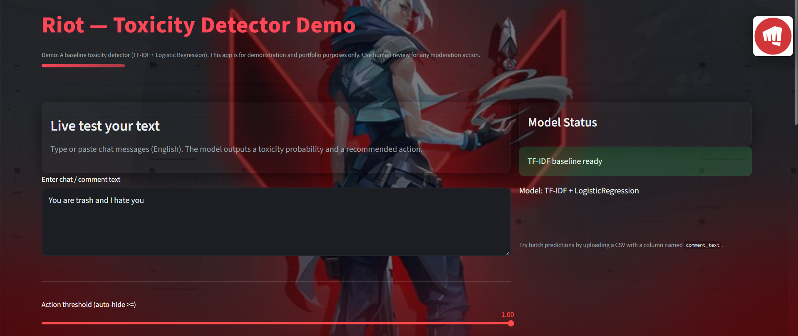

# Riot Toxicity Detector

_A Riot-themed interactive web app that detects toxic messages using machine learning and provides real-time moderation insights._

---

## 📌 Table of Contents
- <a href="#Overview">Overview</a>
- <a href="#features">Features</a>
- <a href="#dataset">Dataset</a>
- <a href="#tools--technologies">Tools & Technologies</a>
- <a href="#project-structure">Project Structure</a>
- <a href="#data-cleaning--preparation">Data Cleaning & Preparation</a>
- <a href="#dashboard">Dashboard</a>
- <a href="#how-to-run-this-project">How to Run This Project</a>
- <a href="#author--contact">Author & Contact</a>

---
<h2><a class="anchor" id="overview"></a>Overview</h2>

The Riot Toxicity Detector is a machine-learning powered tool inspired by Riot Games approach to preventing disruptive behavior.
The app analyzes chat messages and predicts toxicity using a Logistic Regression classifier trained on the Jigsaw Toxic Comment dataset.

It provides:
-  Real-time toxicity detection
-  Token-level explanation
- Action recommendations (Auto-hide, Review, No action)
- A fully themed Riot-style UI built with Streamlit

---
<h2><a class="anchor" id="features"></a>Features</h2>

- ⚡ Real-time toxicity predictions using TF–IDF + Logistic Regression

- 🔍 Token contribution analysis (which words trigger toxicity)

- 🎨 Custom Riot-themed UI with background art & animated styles

- 📤 Batch prediction mode (upload CSV → get toxicity scores instantly)

- 📊 Toxicity probability + recommended moderation action

- 🧠 Expandable for advanced models (BERT, sentence transformers, etc.)

---
<h2><a class="anchor" id="dataset"></a>Dataset</h2>

- Jigsaw Toxic Comment Classification Challenge dataset from Kaggle

---
<h2><a class="anchor" id="tools--technologies"></a>Tools & Technologies</h2>

- Python, Scikit-learn, NumPy, Pandas, Joblib, Tqdm
- Streamlit (Interactive Visualizations), Custom CSS(Riot-Themed)
- GitHub

---
<h2><a class="anchor" id="project-structure"></a>Project Structure</h2>

```
toxicity_detector/
│
├── assets/
│   ├── riot_logo.png
│   ├── splash.jpg
│
├── data/
│   ├── raw/
│   │   ├── train.csv
│   ├── processed/
│       ├── train_clean.parquet
│
├── models/
│   ├── tfidf.joblib
│   ├── baseline_lr.joblib
│   ├── val_preds.csv
│
├── src/
│   ├── data_prep.py
│   ├── train_baseline.py
│   ├── streamlit_toxicity_app.py
│
└── README.md
```

---
<h2><a class="anchor" id="data-cleaning--preparation"></a>Data Cleaning & Preparation</h2>

- The data cleaning pipeline includes:
- Unicode normalization
- URL, email, and username anonymization
- Lowercasing
- Removing special characters
- Collapsing extra whitespace
- Creating a binary toxicity label
- Saving optimized Parquet format for fast loading

---
<h2><a class="anchor" id="dashboard"></a>Dashboard</h2>





---
<h2><a class="anchor" id="how-to-run-this-project"></a>How to Run This Project</h2>

1. Install Dependencies:
```nginx
pip install -r requirements.txt
```
2. Prepare Data:
```bash
python src/data_prep.py
```
3. Train the Model:
```bash
python src/train_baseline.py
```
4. Open Terminal and run:
```arduino
python -m streamlit run streamlit_toxicity_app.py
```


---
<h2><a class="anchor" id="author--contact"></a>Author & Contact</h2>

**Bhavya Patela** <br>
💼 Data Analyst <br>
📧 Email: bhavyapatela100@gmail.com <br>
🔗 [LinkedIn](https://www.linkedin.com/in/bhavya-patela-526a38322/)
